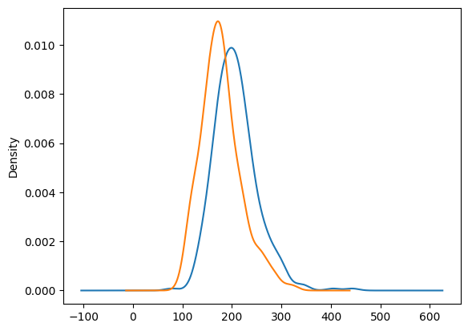
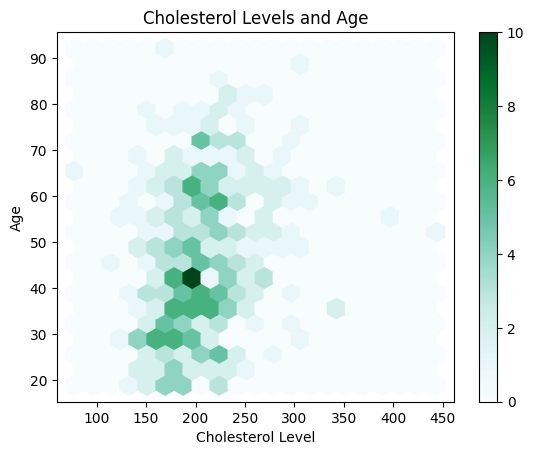
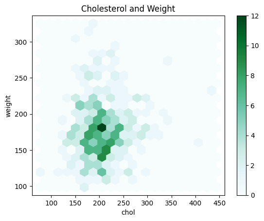
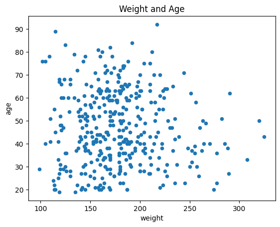

# Visualization of Diabetes Data

Powered by `pandasplot` and `matplotlib`

## Imports
```python
%matplotlib inline
import pandas as pd
import numpy as np
import matplotlib.pyplot as plt
```

## About the Data

This dataset contains health metrics and demographic information for individuals, primarily used for studying diabetes and related health conditions. It includes various blood parameters, such as cholesterol, glucose, and glycated hemoglobin levels, along with physical characteristics like height, weight, and body frame. The data is collected from individuals in two locations, Buckingham and Louisa, and includes demographic details such as age and gender. This dataset can help analyze the relationship between different health metrics and demographic factors, aiding in diabetes research and understanding its impact on different populations.

```python
data_frame = pd.read_csv("diabetes.csv")
# Drop the missing values rows
data_frame = data_frame.dropna()
data_frame.head(5)
```

<div>
<style scoped>
    .dataframe tbody tr th:only-of-type {
        vertical-align: middle;
    }

    .dataframe tbody tr th {
        vertical-align: top;
    }

    .dataframe thead th {
        text-align: right;
    }
</style>
<table border="1" class="dataframe">
  <thead>
    <tr style="text-align: right;">
      <th></th>
      <th>id</th>
      <th>chol</th>
      <th>stab.glu</th>
      <th>hdl</th>
      <th>ratio</th>
      <th>glyhb</th>
      <th>location</th>
      <th>age</th>
      <th>gender</th>
      <th>height</th>
      <th>weight</th>
      <th>frame</th>
      <th>bp.1s</th>
      <th>bp.1d</th>
      <th>waist</th>
      <th>hip</th>
    </tr>
  </thead>
  <tbody>
    <tr>
      <th>0</th>
      <td>1000</td>
      <td>203.0</td>
      <td>82</td>
      <td>56.0</td>
      <td>3.6</td>
      <td>4.31</td>
      <td>Buckingham</td>
      <td>46</td>
      <td>female</td>
      <td>62.0</td>
      <td>121.0</td>
      <td>medium</td>
      <td>118.0</td>
      <td>59.0</td>
      <td>29.0</td>
      <td>38.0</td>
    </tr>
    <tr>
      <th>1</th>
      <td>1001</td>
      <td>165.0</td>
      <td>97</td>
      <td>24.0</td>
      <td>6.9</td>
      <td>4.44</td>
      <td>Buckingham</td>
      <td>29</td>
      <td>female</td>
      <td>64.0</td>
      <td>218.0</td>
      <td>large</td>
      <td>112.0</td>
      <td>68.0</td>
      <td>46.0</td>
      <td>48.0</td>
    </tr>
    <tr>
      <th>2</th>
      <td>1002</td>
      <td>228.0</td>
      <td>92</td>
      <td>37.0</td>
      <td>6.2</td>
      <td>4.64</td>
      <td>Buckingham</td>
      <td>58</td>
      <td>female</td>
      <td>61.0</td>
      <td>256.0</td>
      <td>large</td>
      <td>190.0</td>
      <td>92.0</td>
      <td>49.0</td>
      <td>57.0</td>
    </tr>
    <tr>
      <th>3</th>
      <td>1003</td>
      <td>78.0</td>
      <td>93</td>
      <td>12.0</td>
      <td>6.5</td>
      <td>4.63</td>
      <td>Buckingham</td>
      <td>67</td>
      <td>male</td>
      <td>67.0</td>
      <td>119.0</td>
      <td>large</td>
      <td>110.0</td>
      <td>50.0</td>
      <td>33.0</td>
      <td>38.0</td>
    </tr>
    <tr>
      <th>4</th>
      <td>1005</td>
      <td>249.0</td>
      <td>90</td>
      <td>28.0</td>
      <td>8.9</td>
      <td>7.72</td>
      <td>Buckingham</td>
      <td>64</td>
      <td>male</td>
      <td>68.0</td>
      <td>183.0</td>
      <td>medium</td>
      <td>138.0</td>
      <td>80.0</td>
      <td>44.0</td>
      <td>41.0</td>
    </tr>
  </tbody>
</table>
</div>

## Plotting the Data
### Cholesterol Levels vs Weight

This code visualizes the distribution of cholesterol levels and weight within the dataset using density plots. A density plot provides a smooth estimate of the data distribution, highlighting where values are concentrated over a continuous interval.

```python
data_frame["chol"].plot.density()
data_frame["weight"].plot.density()
```



### Cholesterol Levels and Age
A view of the data at a new angle; comparing the Cholesterol Levels to Ages in order to see how that match up. As we can see, Most of our subjects' records indicate their cholesterol levels to be within the 150-250 range with some outliers. 

```python
# Scatter plot for cholesterol levels and age
data_frame.plot(kind='hexbin', x='chol', y='age', gridsize=20, title='Cholesterol Levels and Age')
plt.xlabel('Cholesterol Level')
plt.ylabel('Age')
plt.show()
```



### Cholesterol and Weight

Uses a Cartesian coordinate system to plot points along a grid where the X and Y axis are separate variables.

Each point is assigned a label or category. Each plotted point then represents a third variable by the area of its circle. Colors can be used to distinguish between categories or used to represent an additional data variable. 

Used to compare and show the relationships between categorised circles, by the use of positioning and proportions. The overall picture can be use to analyse for patterns/correlations.

```python
data_frame.plot(kind='hexbin', x='chol', y='weight',
        gridsize=20,
        title="Cholesterol and Weight")
```



### Weight and Age
Initially, density plots suggest that weight influences cholesterol levels. However, hexbin plots for both weight vs. cholesterol and age vs. cholesterol appear similar. This raises the question: does age influence cholesterol levels?

To explore this, we will examine the relationship between age and weight to determine if age significantly affects weight, which might in turn influence cholesterol levels.

```python
data_frame.plot(kind='scatter', x='weight', y='age', 
        title="Weight and Age")
```



## Conclusion

Based on our analysis, the scatter plot for age versus weight is widely dispersed, indicating no significant correlation between the two variables. This suggests that age does not influence weight in a meaningful way. Consequently, it's unlikely that age impacts cholesterol levels through weight. Therefore, the initial impression that weight alone influences cholesterol levels remains valid, and age does not appear to be a contributing factor.